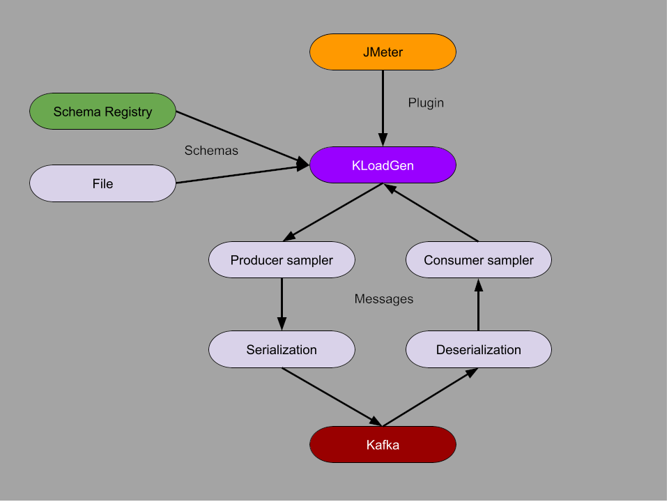

# KLoadGen architecture

KLoadGen is a JMeter plugin that sends and receives Kafka messages. It also allows to establish a connection to a Schema Registry server to get schemas.

## Project structure

KLoadGen includes the following components:

- **Kafka Producer Sampler:** this JMeter Java sampler sends messages to Kafka. It uses the key and value configuration and generates a message matching that definition.

  - **Schema Registry Config:** this JMeter config element allows to configure the connection to a Schema Registry server, with all the details needed for a secure login.

  - **KLG - Kafka Headers Config:** this JMeter config element generates serialized object messages based on the input class and its properties' configurations.

  - **KLG - Value Schema Serializer Config:** this JMeter config element allows to configure a value schema obtained from a Schema Registry server.

  - **KLG - Value Schema File Serializer Config:** this JMeter config element allows to upload a value schema file instead of getting it from the Schema Registry server.
 
  - **KLG - Key Schema Serializer Config:** this JMeter config element allows to configure a key schema obtained from a Schema Registry server.

  - **KLG - Key Schema File Serializer Config:** this JMeter config element allows to upload a key schema file instead of getting it from the Schema Registry server.
 
  - **KLG - Simple Key Config:** this JMeter config element allows to define a simple basic key to send into the message.

  - **KLG - Simple Value Config:** this JMeter config element allows to define a simple basic value to send into the message.

> You can go through the details of setting up this sampler and its configuration elements in the [Producer configuration](producer-configuration.md) page.
 
- **Kafka Consumer Sampler:** this JMeter Java sampler reads messages from Kafka. It uses the key and value configuration to deserialize the messages that it reads.

  - **KLG - Value Schema Deserializer Config:** this JMeter config element allows to define how the message value is deserialized.

  - **KLG - Value Schema File Deserializer Config:** this JMeter config element allows to upload a value schema file to deserialize the message value.

  - **KLG - Key Schema Deserializer Config:** this JMeter config element allows to define how the message key is deserialized.

  - **KLG - Key Schema File Deserializer Config:** this JMeter config element allows to upload a key schema file to deserialize the message key.

> You can go through the details of setting up this sampler and its configuration elements in the [Consumer configuration](consumer-configuration.md) page.

