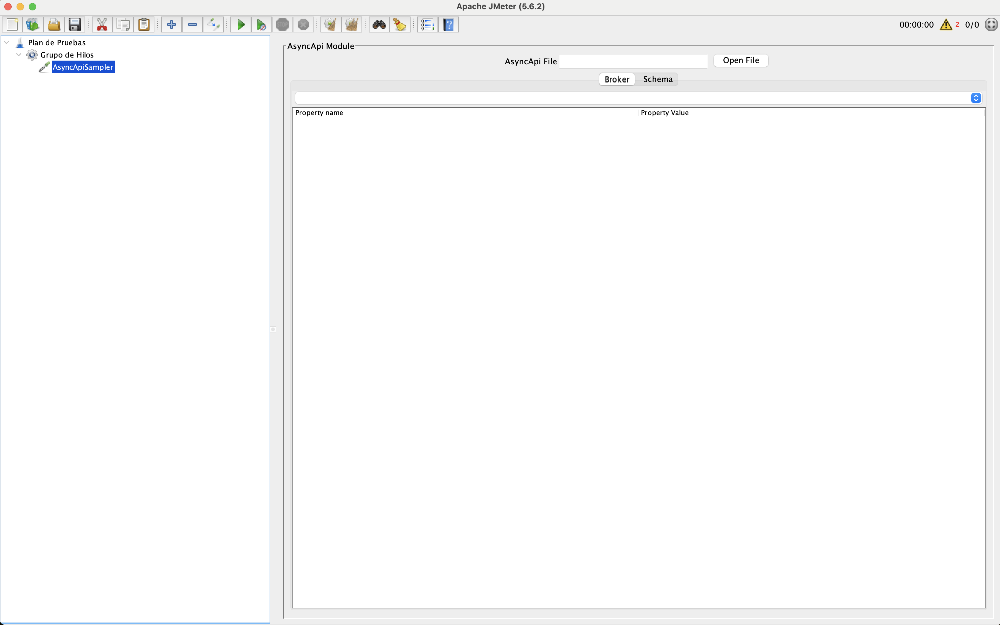
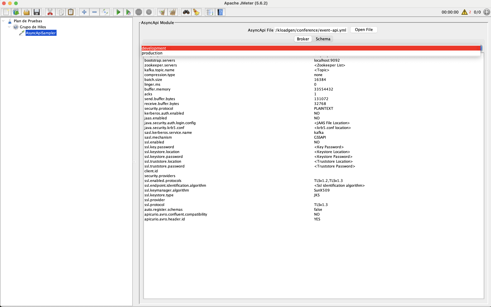
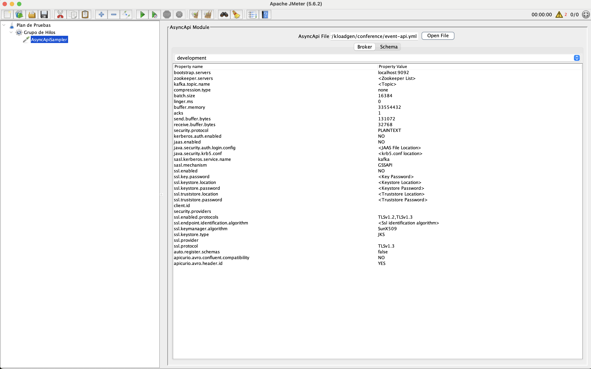
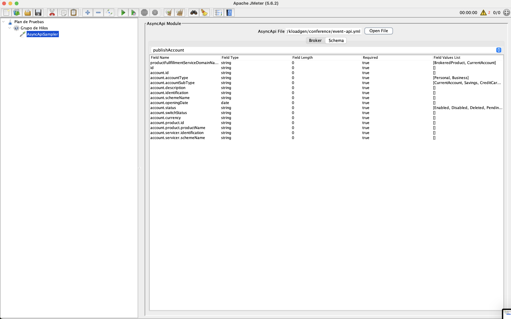

# Asyncapi Support

Here you can find the way to use your asyncapi.yml definition to produce a performance load test.
The only requirement is to use the AsyncApi Sampler component. There you can load the asyncapi file into the plugin.

Once the file is loaded, information will appear in the elements below.
First tab you can see the broker configuration where you can choose to which broker you want to connect to.

Once the broker has been choose the data will be loaded. By default the first server configuration will be selected

In order to choose which payload you want to use for the test just move to the second tab and use the combo to select which topic you want to use. 
As for in AsyncApi specification channel/topic contains the payload will be transmitted.

Data generation use the same engine than the rest of the samplers so information from [schemas page](schemas.md) applu