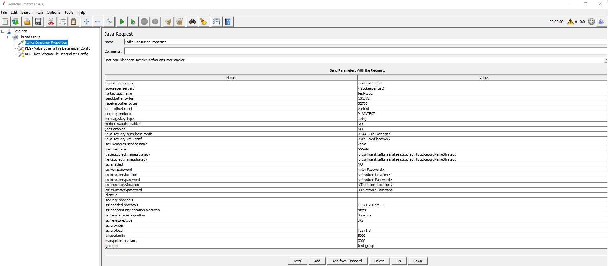

# Consumer configuration

Here you can find the list of the parameters to be configured when defining the consumer side for the plugin.

## Kafka Consumer Sampler configuration

- `bootstrap.servers`: list of Bootstrap servers with format: _broker-ip-1_:_port_, _broker-ip-2_:_port_, _broker-ip-3_:_port_.
- `zookeeper.servers`: list of Zookeeper servers with format: _zookeeper-ip-1_:_port_, _zookeeper-ip-2_:_port_, _zookeeper-ip-3_:_port_.
- `kafka.topic.name`: topic on which messages will be sent.
- `send.buffer.bytes`: the size of the TCP send buffer (`SO_SNDBUF`) to use when sending data. If the value is `-1`, the OS default will be used. The default value is `131072`.
- `receive.buffer.bytes`: the size of the TCP receive buffer (`SO_RCVBUF`) to use when reading data. If the value is `-1`, the OS default will be used. The default value is `32768`.
- `auto.offset.reset`: the initial position for each assigned partition when the group is first created before consuming any message. Valid values are: `earliest`/`latest`. The default value is `earliest`.
- `security.protocol`: Kafka consumer protocol. Valid values are: `PLAINTEXT`/`SSL`/`SASL_PLAINTEXT`/`SASL_SSL`.
- `message.key.type`: default message key type. The default value is: `string`.
- `kerberos.auth.enabled`: establishes whether the Kerberos authorization is enabled or disabled. If it is disabled, the next two properties will be ignored. The default value is `NO`.
- `java.security.krb5.conf`: location of the `krb5.conf` file for the Kerberos server.
- `sasl.kerberos.service.name`: Kafka Kerberos service name. The default value is `kafka`.
- `jaas.enabled`: establishes whether JAAS is enabled or disabled. The default value is `NO`.
- `java.security.auth.login.config`: location of the `jaas.conf` file for Kafka Kerberos.
- `sasl.mechanism`: configures the SASL mechanism to use to connect to the Kafka cluster. The default value is `GSSAPI`.
- `value.subject.name.strategy`: default value name strategy. The default value is `io.confluent.kafka.serializers.subject.TopicRecordNameStrategy`.
- `key.subject.name.strategy`: default key name strategy. The default value is `io.confluent.kafka.serializers.subject.TopicRecordNameStrategy`.
- `ssl.enabled`: establishes whether SSL is enabled or disabled. The default value is `NO`.
- `ssl.key.password`: SSL password.
- `ssl.keystore.location`: SSL keystore location.
- `ssl.keystore.password`: SSL keystore password.
- `ssl.truststore.location`: SSL trust store location.
- `ssl.truststore.password`: SSL trust store password.
- `client.id`: Kafka producer client ID.
- `security.providers`: establishes the security providers. The default value is blank.
- `ssl.enabled.protocols`: SSL enabled protocols. Valid values are: `TLSv1.2`/`TLSv1.3`. The default value is `TLSv1.2,TLSv1.3`.
- `ssl.endpoint.identification.algorithm`: SSL endpoint identification algorithm. You can leave the default value if you don't want to set it. The default value is `https`.
- `ssl.keymanager.algorithm`: the algorithm used by the key manager factory for SSL connections. The default value is `SunX509`.
- `ssl.keystore.type`: type of the repository of security certificates.
- `ssl.provider`: the name of the security provider used for SSL connections.
- `ssl.protocol`: the SSL protocol used to generate the SSLContext.
- `timeout.millis`: the maximum time trying to poll before considering the current partitions as empty.
- `max.poll.interval.ms`: the maximum delay between invocations of `poll()`. If `poll()` is not called before expiration of this timeout, the consumer is considered failed and the group will rebalance. This value should be less than `timeout.millis`.
- `group.id`: specifies the name of the consumer group the consumers will belong to.

>The KLoadGen Consumer Sampler is compatible with JSON Schema, AVRO and PROTOBUF schemas. If JSON Schema or PROTOBUF are being used, no extra configuration is needed, the sampler will work with the default deserialization settings. If AVRO is being used, the deserializer settings need to be configured in order to define how messages will be deserialized. You can choose whether you define the settings manually or whether you load a file with them.

## Kafka consumer configuration elements

These are the configuration elements corresponding to the Kafka consumer. See below the details for each one.

KLoadGen includes a deserializer, apart from the ones from Kafka. [Make sure to choose the best option for you.](#custom-deserializer)

### KLG - Value Schema Deserializer Config

This configuration element allows to get the correct schema from the Schema Registry and use it to deserialize the read messages.

You need to provide values for **Name Strategy** and **Deserializer**.

**Note:** If you are using an AVRO schema, you need to choose **KafkaAvroDeserializer** (`io.confluent.kafka.serializers.KafkaAvroDeserializer`) in **Deserializer**.

### KLG - Value Schema File Deserializer Config

This configuration element allows to select a schema from a file (`.avsc`).

You need to provide values for **Deserializer** and **Schema Type**.

Make sure that you choose our custom deserializer (`com.sngular.kloadgen.serializer.AvroDeserializer`) in **Deserializer**. 

The **Open** button allows to load the corresponding file. 

The AVRO structure will be flattened and shown in the table. 

- **Field Name**: flattened field name composed by all the properties from the root class. Ex: `PropClass1.PropClass2.PropClass3`.
  **Note**: 
    - The arrays show `[]` at the end
    - The maps show `[:]` at the end.  
- **Field Type**: you can see the complete list in [Field types](https://github.com/sngular/kloadgen/wiki/schemas#field-types).
  
### KLG - Key Schema Deserializer Config

This configuration element is similar to [KLG - Value Schema Deserializer Config](#KLG---value-schema-deserializer-config), except that it is focused in a key schema instead of a value schema.

Whatever schema you define and configure here will be used to deserialize the message key.

### KLG - Key Schema File Deserializer Config

This configuration element is similar to [KLG - Value Schema File Deserializer Config](#KLG---value-schema-file-deserializer-config), except that it is focused in a key schema instead of a value schema.

Whatever schema you define and configure here will be used to deserialize the message key.

## Custom Deserializer

- **AvroDeserializer**: uses GenericDatumReader to read the data and transform it into an Object, then sends it.