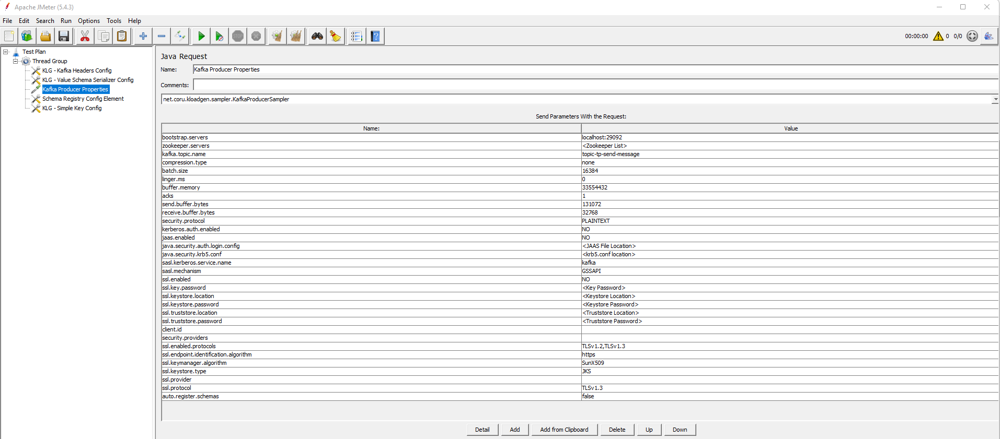

## Test plan example

The repository includes a [sample file](https://github.com/corunet/kloadgen/blob/master/Example-Test-Plan.jmx) with an example of a JMeter test plan that uses elements defined in this plugin. 

This test plan will only inject messages in a Kafka cluster. 

**Note:** Before executing it, you should add the Schema Registry information in order to retrieve the schema and extract the entities' structure.