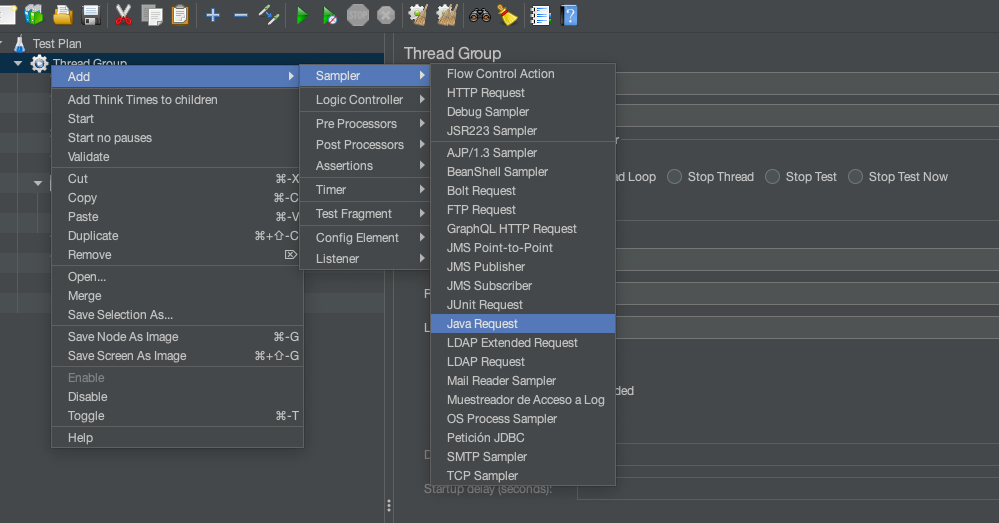
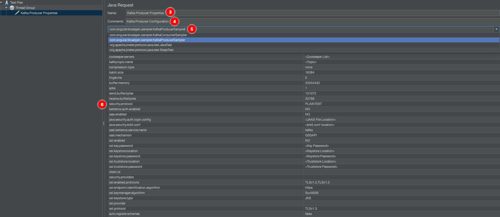
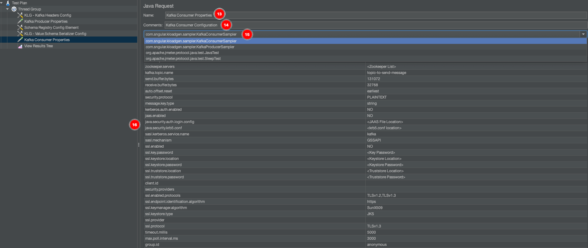
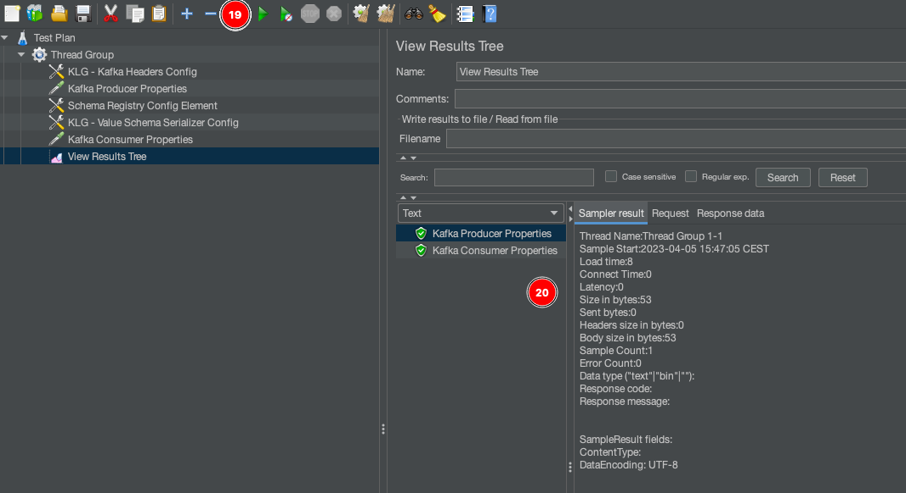
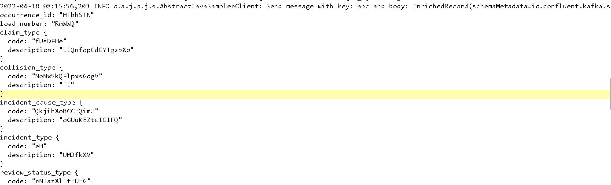
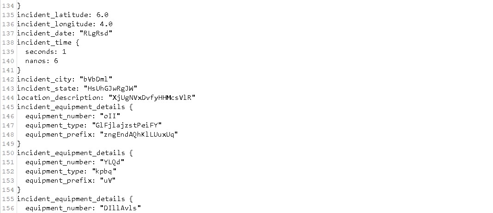
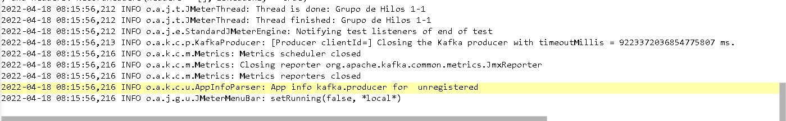

# How to run a test plan

You can create and run test plans for the consumer side, the producer side or both the consumer and the producer sides of the Kafka messages. 

Here you will see how to create and run a test plan that includes both the producer and the consumer sides of the Kafka messages from JMeter.

1. Create a new test plan in JMeter.
2. Under **Thread Group**, add a **Java Request** sampler.
   
3. In **Name**, assign a descriptive name for  this sampler.
4. (Optional) You may add any description for the sampler under **Comments**.
5. In the dropdown box, choose **com.sngular.kloadgen.sampler.KafkaProducerSampler**. 
6. Provide the corresponding values for this sampler, as explained in [Kafka Producer Sampler configuration](https://github.com/sngular/kloadgen/wiki/producer-configuration#kafka-producer-sampler-configuration).
   
7. Under **Thread Group**, add the configuration elements for this sampler, as seen in [Kafka producer configuration elements](https://github.com/sngular/kloadgen/wiki/producer-configuration#kafka-producer-configuration-elements).
8. In the value and key schema (file) configuration elements, complete the table with the corresponding information regarding **Field Name**, **Field Type**, **Field Length**, and **Field Value List**.
  **Note:** The values you include in **Field Values List** will be used by the random tool. Instead of creating random values, it will choose the values randomly between the ones included here. 
9. (Optional) You can assign sizes to any map or array field (`[10]` for arrays, `[10:]` for maps).
10. If you want to assign a sequence to any field, see [Sequences](https://github.com/sngular/kloadgen/wiki/schemas#sequences).
11. If you want to assign an iterator to any field, see [Iterators](https://github.com/sngular/kloadgen/wiki/schemas#iterators).
12. Under **Thread Group**, add a new **Java Request sampler**.
13. In **Name**, assign a descriptive name for  this sampler.
14. (Optional) You may add any description for the sampler under **Comments**.
15. In the dropdown box, choose **com.sngular.kloadgen.sampler.KafkaConsumerSampler**.
16. Provide the corresponding values for this sampler, as explained in [Kafka Consumer Sampler configuration](https://github.com/sngular/kloadgen/wiki/consumer-configuration#kafka-consumer-sampler-configuration).
    
17. Under **Thread Group**, add the configuration elements for this sampler, as seen in [Kafka consumer configuration elements](https://github.com/sngular/kloadgen/wiki/consumer-configuration#kafka-consumer-configuration-elements).
18. Save the test plan.
19. Run the test plan.
20. Check your results.
    

The following screenshots show the load test process in JMeter:

 
 

