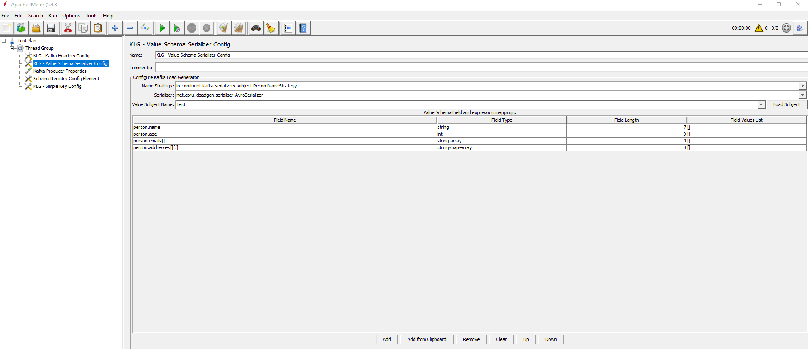
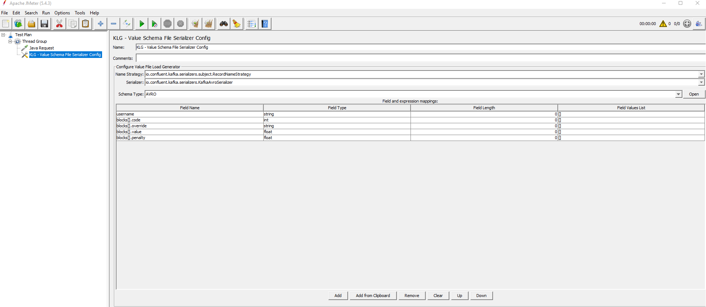

# Producer configuration

Here you can find the list of the parameters to be configured when defining the producer side for the plugin.

## Kafka Producer Sampler configuration

- **bootstrap.servers**: list of Bootstrap servers with format: broker-ip-1:port, broker-ip-2:port, broker-ip-3:port. 
- **zookeeper.servers**: list of Zookeeper servers with format: zookeeper-ip-1:port, zookeeper-ip-2:port, zookeeper-ip-3:port.
- **kafka.topic.name**: topic on which messages will be sent.
- **compression.type**: Kafka producer compression type. Valid values are: none/gzip/snappy/lz4. The default value is _none_.
- **batch.size**: messages batch size. If you define a compression type such as lz4, and also increase this batch size value, you get better throughput. The default value is _16384_. 
- **linger.ms**: establishes how much time the producer should wait until the batch becomes full. If the batch size is increased and compression is enabled, it should be in the range _5-10_. The default value is _0_.
- **buffer.memory**: total buffer memory for producer. The default value is _33554432_. 
- **acks**: acknowledgement of message sent. Valid values are: 0/1/-1. The default value is _1_. 
- **send.buffer.bytes**: the size of the TCP send buffer (SO_SNDBUF) to use when sending data. If the value is _-1_, the OS default will be used. The default value is _131072_.
- **receive.buffer.bytes**: the size of the TCP receive buffer (SO_RCVBUF) to use when reading data. If the value is _-1_, the OS default will be used. The default value is _32768_.
- **security.protocol**: Kafka producer protocol. Valid values are: PLAINTEXT/SSL/SASL_PLAINTEXT/SASL_SSL. The default value is _PLAINTEXT_.
- **kerberos.auth.enabled**: establishes whether the Kerberos authorization is enabled or disabled. If it is disabled, the two following properties will be ignored. The default value is _NO_.
- **java.security.krb5.conf**: location of the krb5.conf file for the Kerberos server.
- **sasl.kerberos.service.name**: Kafka Kerberos service name. The default value is _kafka_.
- **jaas.enabled**: establishes whether JAAS is enabled or disabled. The default value is _NO_.
- **java.security.auth.login.config**: location of the jaas.conf file for Kafka Kerberos.
- **sasl.mechanism**: configures the SASL mechanism to use to connect to the Kafka cluster. The default value is _GSSAPI_.
- **ssl.enabled**: establishes whether SSL is enabled or disabled. The default value is _NO_.
- **ssl.key.password**: SSL password.
- **ssl.keystore.location**: SSL keystore location.
- **ssl.keystore.password**: SSL keystore password. 
- **ssl.truststore.location**: SSL trust store location. 
- **ssl.truststore.password**: SSL trust store password.
- **client.id**: Kafka producer client ID.
- **security.providers**: establishes the security providers. The default value is _blank_.
- **ssl.enabled.protocols**: SSL enabled protocols. Valid values are: TLSv1.2/TLSv1.3. The default value is _TLSv1.2,TLSv1.3_.
- **ssl.endpoint.identification.algorithm**: SSL endpoint identification algorithm. You can leave the default value if you don't want to set it. The default value is _https_.
- **ssl.keymanager.algorithm**: the algorithm used by the key manager factory for SSL connections. The default value is _SunX509_.
- **ssl.protocol**: the SSL protocol used to generate the SSLContext. The default value is _TLSv1.3_.
- **ssl.keystore.type**: type of the repository for the security certificates. The default value is _JKS_.
- **ssl.provider**: the name of the security provider used for SSL connections. The default value is _blank_.
- **ssl.protocol**: the SSL protocol used to generate the SSLContext. The default value is _TLSv1.3_.
- **auto.register.schemas**: allows or disallows the Schema Registry client to register the schema if missing. The default value is _false_.

## Kafka producer configuration elements

These are the configuration elements corresponding to the Kafka producer. See below the details for each one.

### Schema Registry Config

This configuration element establishes the connection to the Schema Registry and retrieves the list of subjects included there.

You need to provide the URL for the Schema Registry server in the **Schema Registry URL** field and set up the following properties:

> Only the actual set of properties are supported.

| Property | Values | Description                             |
|----------|--------|-----------------------------------------|
| schema.registry.auth.enabled | YES/NO | Enables/disables security configuration |
| schema.registry.auth.method | BASIC/BEARER | Authentication method type              |
| schema.registry.username | String | The username                            |
| schema.registry.password | String | The password                            |
| schema.registry.bearer | String | The bearer for token authentication    |

The **Test Registry** button will test the connection properties and retrieve the subject list from the Schema Registry.

A confirmation message will be shown with the number of subjects retrieved from the Registry.

The subject list will be used when configuring the AVRO schema to download.

### Serializer configuration elements

KLoadGen includes five serializers, apart from the ones from Kafka. [Make sure to choose the best option for you.](#custom-serializers)

KLoadGen includes four elements to configure the schema that will be used to serialize the data: [Value Schema Serializer Config](#value-schema-serializer-config), [Value Schema File Serializer Config](#value-schema-file-serializer-config), [Key Schema Serializer Config](#key-schema-serializer-config), and [Key Schema File Serializer Config](#key-schema-file-serializer-config).

#### Value Schema Serializer Config

This configuration element allows to choose a subject and download its schema.

You need to provide values for **Name Strategy** and **Serializer** to get the list of subjects. The **Load Subject** button loads the schema for the chosen subject.

#### Value Schema File Serializer Config

This configuration element allows to load a schema from a file (.avsc, .json or .proto).

You need to provide values for **Name Strategy**, **Serializer** and **Schema Type**. 

The **Open** button loads the file.

**Note**: If the file includes embedded schemas, the last definition will be considered the main one, and the ones above will be considered as related to it. If there are unrelated schemas, they will be ignored.

#### Key Schema Serializer Config

This configuration element is similar to [Value Schema Serializer Config](#value-schema-serializer-config), except that it is focused in a key schema instead of a value schema.

Whatever schema you define and configure here will be used as the message key.

#### Key Schema File Serializer Config

This configuration element is similar to [Value Schema File Serializer Config](#value-schema-file-serializer-config), except that it is focused in a key schema instead of a value schema.

Whatever schema you define and configure here will be used as the message key.

#### Common table for flattened structure

The four previous configuration elements share the same table, which includes the flattened structure that will be used to generate the random values.

  - **Field Name**: flattened field name composed by all the properties from the root class. Ex: PropClass1.PropClass2.PropClass3.   
    **Note**: 
       - The arrays show `[]` at the end. If you want to define a specific size for the array, just type the number inside (i.e. `[10]`). 
       - The maps show `[:]` at the end. If you want to define a specific size for the map, just type the number to the left of the colon (i.e. `[10:]`).        
  - **Field Type**: field type, such as String, Int, Double, Array, etc.  For a complete list of field types, see [Field types](schemas.md#field-types).
  - **Field Length**: field length configuration for the Random Tool. For strings, it indicates the number of characters. For numbers, it indicates the number of digits.
  - **Field Values List**: possible list of values for the field, which will be used by the Random Tool to generate values.
    **Note**: If the field type is an array or a map, you can define a specific list of values  (*[1,2,3,4,5]* or *[key1:value1, key2:value2, key3:value3]*).

### Simple Key Config

This configuration element allows to define a simple key with primitive types.

You need to provide values for **Key Value**, **Key Class Type** and **Serializer**.

### Kafka Headers Config

This configuration element allows to specify a list of headers which will be included in the producer. 

The headers specified here will be included in every message after they are serialized.

Values will also be included. They will be considered of type `string`, whether they are supplied in the table or randomly generated.

## Custom Serializers

- **AvroSerializer**: adds a header with the id of the schema, uses GenericDatumWriter to transform the data into an array of bytes and sends it.

- **GenericAvroRecordBinarySerializer**: uses SpecificDatumWriter to transform the data into an array of bytes and sends it.

- **GenericAvroRecordSerializer**: uses SpecificDatumWriter to transform the data into JSON and sends it.

- **GenericJsonRecordSerializer**: maps the data and sends it.

- **ProtobufSerializer**: transforms the data into an array of bytes and sends it.