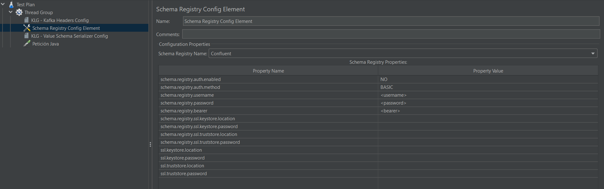

# Configuration Schema Registry

Although we support the use of schemas without external dependencies such as Schema Registry, it is common to use it, since it allows to
have control of the schemas with versions.

To choose the use of Schema Registry it is necessary to do it in the following way introducing the basic properties that appear in the
image:

The properties are supported by the schema registry available to us (At the moment are Confluent Schema Registry, and Apicurio Schema Registry)

A list of the properties explained here:
* `schema.registry.auth.enabled` If your schema registry have auth enabled or not
* `schema.registry.auth.method` The method to connect with your schema registry
* `schema.registry.username` Username
* `schema.registry.password` Password
* `schema.registry.bearer`	Token for SASL/OAUTHBEARER
* `schema.registry.keystore.location` The absolute path of the keystore file for the schema registry
* `schema.registry.keystore.password` The password that protects the keystore file for the schema registry
* `schema.registry.truststore.location` The absolute path of the truststore file for the schema registry
* `schema.registry.truststore.password` The password that protects the truststore file for the schema registry
* `ssl.keystore.location` The absolute path of the keystore file for the connection against the schema registry
* `ssl.keystore.password` The password that protects the keystore file for the connection against the schema registry
* `ssl.truststore.location` The absolute path of the truststore file for the connection against the schema registry
* `ssl.truststore.password` The password that protects the truststore file for the connection against the schema registry

## Some Recommendations

To avoid having unclear schemas, when use Apicurio they recommend using this functionality instead of auto-generating.
https://www.apicur.io/registry/docs/apicurio-registry/2.1.x/assets-attachments/registry-rest-api.htm#tag/Artifacts/operation/createArtifact

However, in Confluent Schema Registry, they take the SubjectName as ID, so remember it if you see a different name in your Schema List.

