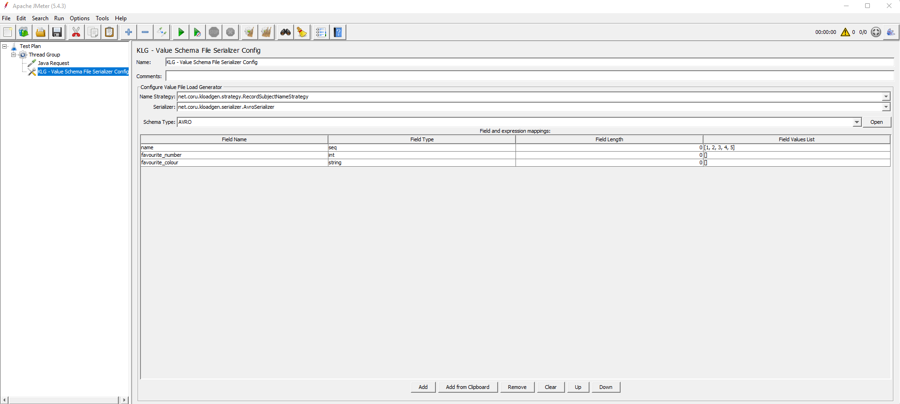

# Schemas

This page includes information regarding the schemas in relation to this plugin.

## Field types

These are the field types that are supported in the schemas for this plugin.

| Type                        | Details                                       | Returns                                                                                                  |
|-----------------------------|-----------------------------------------------|----------------------------------------------------------------------------------------------------------|
| null                        | Field of type `null`                          | See [Null values](#null-values) for details                                          |
| boolean                     | Field of type `boolean`                       | Random boolean value                                                                                     |
| int                         | Field of type `int`                           | Random integer value                                                                                     |
| short                       | Field of type `short`                         | Random short value                                                                                       |
| long                        | Field of type `long`                          | Random long value                                                                                        |
| float                       | Field of type `float`                         | Random float value                                                                                       |
| double                      | Field of type `double`                        | Random double value                                                                                      |
| bytes                       | Field of type `bytes`                         | Random bytes value                                                                                       |
| string                      | Field of type `string`                        | Random string with a longitude of 20 characters                                                          |
| enum                        | Field of type `enum`                          | Random enum value based on the AVRO enum type definition                                                 |
| number                      | Field of type `number`                        | Random number value                                                                                      |
| array                       | Field of type `array`                         | See [Arrays and maps](#arrays-and-maps) for details on this field.                                       |
| map                         | Field of type `map`                           | See [Arrays and maps](#arrays-and-maps) for details on this field.                                       |
| timestamp                   | Field of type `timespan`                      | Random timestamp value                                                                                   |                                                                               
| stringTimestamp             | Field of type `string` but coding a Timestamp | `Localdatetime.now` formatted as string                                                                    |
| longTimestamp               | Field of type `long` but coding a Timestamp   | `Localdatetime.now` formatted as long                                                                      |
| uuid                        | Field of type `uuid`                          | Random UUID value                                                                                        |                                                                                            
| bytes_decimal               | Field of type `bytes`                         | Random decimal with given precision and scale                                                            |                                                            
| fixed_decimal               | Field of type `string`                        | Random decimal with given precision and scale                                                            |                                                            
| string_uuid                 | Field of type `string` but coding a UUID      | Random UUID string                                                                                       |                                                                                       
| int_date                    | Field of type `int`                           | Random number of days representing a date between 1-1-1900 and 1-1-2100                                  |                                  
| int_time-millis             | Field of type `int`                           | Random number of milliseconds representing an hour                                                       |                                                      
| long_time-micros            | Field of type `long`                          | Random number of microseconds representing an hour                                                       |                                                     
| long_timestamp-millis       | Field of type `long`                          | Random number of milliseconds representing a timestamp between 1-1-1900 and 1-1-2100                     |                     
| long_timestamp-micros       | Field of type `long`                          | Random number of microseconds representing a timestamp between 1-1-1900 and 1-1-2100                     |                   
| long_local-timestamp-millis | Field of type `long`                          | Random number of milliseconds representing a timestamp between 1-1-1900 and 1-1-2100 in a local timezone | 
| long_local-timestamp-micros | Field fo type `long`                          | Random number of microseconds representing a timestamp between 1-1-1900 and 1-1-2100 in a local timezone |

### Arrays and maps

The `array` and `map` types are shown as `*-array` and `*-map`, respectively, in the column **Field Type**. See each field on detail in the next table. 

**Notes for array fields**:
 - Arrays appear in the **Field Name** column with **[]** at the end of the field name (i.e. `metadata.extensions.flows[].correlation[]`).
 - The sample data for array fields will be generated using the data included in **Field Values List** as a comma separated value list.
 
**Notes for map fields**:
 - Maps appear in the **Field Name** colum with **[:]** at the end of the field name (i.e. `metadata.extensions.flows[].correlation[:]`).
 - The sample data for map fields will be generated using the data included in **Field Values List** as a comma separated value list. These values can be sets of pairs _key:value_ (`key1:value`, `key2:value`, `key3:value`) or just as a set of keys (`key1,key2,key3`). In this last case, the values will be randomly generated following the applicable constraints.

| Type           | Details                                | Returns                                                         |
|----------------|----------------------------------------|-----------------------------------------------------------------|
| int-array      | Field of type `array` of Int           | Random-sized array of randomly generated integers               |
| long-array     | Field of type `array` of Long          | Random-sized array of randomly generated longs                  |
| double-array   | Field of type `array` of Double        | Random-sized array of randomly generated doubles                |
| short-array    | Field of type `array` of Short         | Random-sized array of randomly generated shorts                 |
| number-array   | Field of type `array` of Number        | Random-sized array of randomly generated numbers                |
| float-array    | Field of type `array` of Float         | Random-sized array of randomly generated floats                 |
| string-array   | Field of type `array` of String        | Random-sized array of randomly generated strings                |
| uuid-array     | Field of type `array` of UUIDs         | Random-sized array of randomly generated UUIDs                  |
| boolean-array  | Field of type `array` of Boolean       | Random-sized array of randomly generated booleans               |
| int-map        | Field of type `map` of String, Int     | Random-sized map of randomly generated pairs of string, integer |
| long-map       | Field of type `map` of String, Long    | Random-sized map of randomly generated pairs of string, long    |
| double-map     | Field of type `map` of String, Double  | Random-sized map of randomly generated pairs of string, double  |
| short-map      | Field of type `map` of String, Short   | Random-sized map of randomly generated pairs of string, short   |
| number-map     | Field of type `map` of String, Number  | Random-sized map of randonmy generated pairs of string, number  |
| float-map      | Field of type `map` of String, Float   | Random-sized map of randomly generated pairs of string, float   |
| string-map     | Field of type `map` of String, String  | Random-sized map of randomly generated pairs of string, string  |
| uuid-map       | Field of type `map` of String, UUID    | Random-sized map of randomly generated pairs of string, UUID    |
| boolean-map    | Field of type `map` of String, Boolean | Random-sized map of randomly generated pairs of string, boolean |

## Special field types

### Arrays and maps combined

You can also have these special types:

- An array of maps, `(*)-map-array`, following this pattern: _ArrayOfMaps_[_ArraySize_][_MapSize:_].
- A map of arrays, `(*)-array-map`, following this pattern: _MapOfArrays_[_MapSize:_][_ArraySize_].

> Pay attention to the colon. Arrays do not have colon, maps do. The size for maps is set to the left of the colon (`[8:]`). 

### Sequences

A special type has also been created, `seq`, to allow creating a custom sequence of values. 

In order to create a sequence, you need to specify `seq` as **Field Type**.

> In previous versions (up to 4.0.0), typing `{` in **Field Values List** was another requirement in order to create sequences. This is no longer required or supported.

| Type | Details                                                             |  Returns |
|----------|-------------------------------------------------------------------------------|--------|
| seq | Generates a numeric sequence starting in 1. Will cast to the AVRO Field Type | Returns a sequence starting in 1 |

**Note:** If you want to specify a starting value, put it in the **Field Values List** field.

> Sequences don't accept more than one value in the **Field Values List** field.

> Keep in mind to avoid Cast exceptions.

This screenshot shows an example of how KLoadGen generates sequences:



The field name will be generated as sequences from 1 to 5.

### Iterators

It has also been created a new type of field, `it`, to allow creating a custom iterator of values.

In order to create an iterator, you need to specify `it` as **Field Type**.

| Type | Details                                                                                                             | Returns                                   |
|------|---------------------------------------------------------------------------------------------------------------------|-------------------------------------------|
| it   | Generates and iteration of values. It will return `null` if it doesn't find a value in the **Field Values List** field | Returns an iteration of the given values |

### Date and Time types

Every kind of schema manage date and time types in a different way when they are passed as constant values from JMeter, at the moment of random values generation:
- Avro has its own dates system, so it's no necessary implement anything.
- In Json, these types are implemented as a String with a specific format properly defined by KLoadGen.
- For Protobuf definition, KLoadGen only supports `Date` and `TimeOfDay`. The rest of types are in development.
  - If specific values wants to be passed from JMeter they must be strings compatibles with `ISO_LOCAL_DATE` for `Date` and `ISO_LOCAL_TIME` or `ISO_OFFSET_TIME` for `TimeOfDay`.
  - If the offset is indicated (for example 10:20:30-04:00), the value of return will have the amount of time subtracted or added it. Otherwise, the offset value will be established by default according to local zone.

## Null values

KLoadGen supports the use of `null` values in **Field Values List** for any optional field defined in a schema.

This applies to any field defined as `"type": ["null", AnyType]` in an AVRO schema or as `optional` in a PROTOBUF schema, or to any field not included in the `required` array in a JSON Schema structure, that **has `null` included** in the corresponding **Field Values List**.

This feature works with simple fields, such as `string`, and also with further complex structures, such as a `string` field inside a `record` field.

There are, though, **two exceptions**.

### Complex objects with optional children

If you have a complex object —such as a map, array or record— defined as **required** and **all of its children fields are optional**, there could be a conflict if all these children fields receive `null` in their `FieldValueList`. Since an object with all of its fields set to `null` is equivalent to a null object, the **required** status of the parent object will be violated.

In case this situation happens, the last child of the object will be generated as it would not have received `null` in `FieldValueList`.

Let's see an example of this:

```
O1-Not Required{
    C1-Not Required,
    C2-Not Required
}
```

In the example above, both the children fields 'C1' and 'C2' receive `null` in their FieldValuesList. Therefore, the result will be `O1: null`, because none of the involved fields is required.

```
O2-Required{
    C3-Not Required
    C4-Not Required
}
```

Here, both the children fields 'C3' and 'C4' receive `null` in their FieldValueList, **violating the required status** of 'O2'. In this case, the **last child will be forcely generated** as if it didn't receive `null`. Therefore, the final result will be `O2: {C3: null, C4: ramdonValue}`.

```
O3-Required{
    C5-Not Required
    O4-Not Required{
        C6-Not Required
        C7-Not Required
    }
}
```

The same applies when there is more than one level. The last child in the last level will be forcely generated as a random value in order to avoid the violation of the main object. In this case, `C7` is the value that gets changed. Therefore, the final result will be `O3: {C5: null, O4: {C6: null, C7: ramdonValue}}` ('04' automatically changes as per the change in 'C7').

### JSON Schema

The other exception applies to JSON Schema: in order to support `null`values, the collections within objects (_type : object_) cannot be null. Therefore, they will be **required by default** and they will be **initialized as an empty collection** if the object than contains them is not `null`.

> Within JSON Schema, a maximum of **2 nesting levels** is allowed.


### Protobuf Schema - Schema Registry

If you need use the Protobuf Schema with the Schema Registry, you must put the subject with the same name as the protobuf file, as the following example:

```
{
    "schema": "...",
    "schemaType": "PROTOBUF",
    "references": [
    {
      "name": "[the_name_you_want].proto",
      "subject": "[the_name_you_want]",
      "version": ...
    }]
}

```
> This example is based on a petition from Schema Registry
